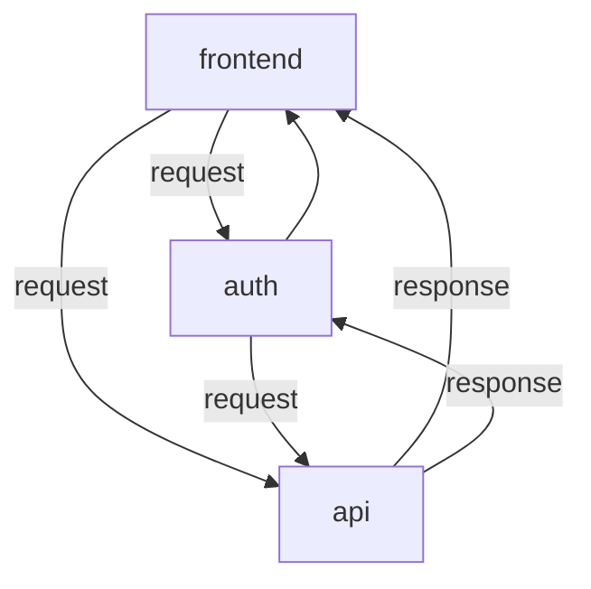

# shanai-sns

SNS的な感じ

## 構成図

## ポート

ローカルで開発する時用のデフォルトのポートとか

| name     | port | description      |
| -------- | :--- | ---------------- |
| frontend | 3000 | フロントエンド   |
| api      | 3001 | 通常のAPI        |
| auth     | 3002 | 認証用のサーバー |
