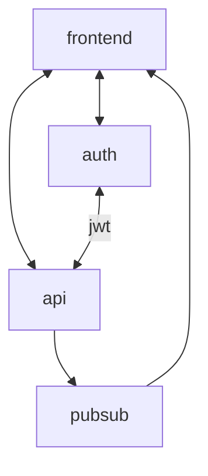

# mqtt でいい感じに pubsub してリアルタイムにチャットするやつ

## 構成図

## ポート

ローカルで開発する時用のデフォルトのポートとか

| name     | port  | description      |
| -------- | :---- | ---------------- |
| frontend | 3000  | フロントエンド   |
| api      | 3001  | 通常の API       |
| auth     | 3002  | 認証用のサーバー |
| pubsub   | 1883  | pubsub           |
| pubsub   | 15675 | pubsub (ws)      |
